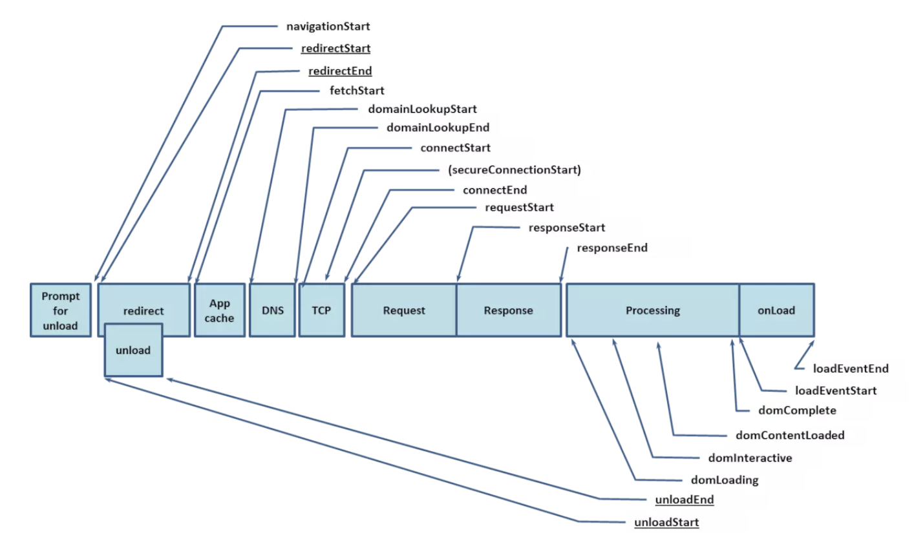

# 记录一次性能优化
> 前端作为页面的直接负责人，当遇到性能问题的时候会被第一个拿出来质问，作为前端必须掌握分析问题定位问题的能力，并且除了改进开发外，也要协调其他部门一起改进
## 分析和定位问题
- 可视化监测

  1. 控制台

      network + Performance 面板

  2. LightHouse等分析页面插件
- 可编程的性能上报方案

  performance 的 timing 属性,可查看以下时间戳
  
  关键性能指标：
  ```
  // firstbyte：首包时间	
  timing.responseStart – timing.domainLookupStart	

  // fpt：First Paint Time, 白屏时间
  timing.responseEnd – timing.fetchStart

  // tti：Time to Interact，首次可交互时间	
  timing.domInteractive – timing.fetchStart

  // ready：HTML 加载完成时间，即 DOM 就位的时间，首屏时间
  timing.domContentLoaded – timing.fetchStart

  // load：页面完全加载时间
  timing.loadEventStart – timing.fetchStart
  ```

  DOMContentLoaded 的触发不需要等待图片等其他资源加载完成，页面上所有的资源（图片，音频，视频等）被加载以后才会触发load事件
## 前端方面

- 大量数据性能优化 - 虚拟列表

  - 可视区域渲染 （确定每项大概高度）

    1. 两个盒子，可视区域、真实列表

    2. 使用一个元素来撑起整个真实列表，让列表的滚动条出现。

    3. 监听可视区域滚动行为，向上滑动时，真实列表下移，显示列表数据startIndex endIndex 相应增加

  - 无限滚动（后台支持分次请求）

    1. 监听父元素的 scroll 事件

    2. scrollHeight - scrollTop < 可视区域,加载更多的数据

- 节流、防抖
- 图片懒加载
- 路由懒加载
- 组件懒加载 组件预加载

  下拉选项框

  hover 状态的时候就开始触发资源的加载
- keep-alive
  >如果大量实例不销毁保存在内存中,那么这个 API 存在内存泄漏的风险,所以要注意调用deactivated销毁。
- 开启浏览器缓存

  >第三方库和我们的代码需要分开打包,我们可以给第三方库设置一个较长的强缓存时间,这样就不会频繁请求第三方库的代码了。

- http 缓存 + webpack hash 缓存策略
  
  1. 对 chunk 进行 hash 化
  2. 开启 hashchunk
      >它的作用是当 chunk 发生改变的时候会生成新的 hash 值,如果不变就不发生变动。这样当 index 加载后续 script资源时如果 hashchunk 没变就会**命中缓存**,如果改变了那么会重新去服务端加载新资源。
- 服务器渲染

  伪服务器渲染

  预渲染插件prerender-spa-plugin解决vue的SPA项目的SEO问题
  在本地模拟浏览器环境,预先执行我们的打包文件
- 开启http2

  浏览器并发限制,我们最多一次性请求 6 次

  http2 可以进行**多路复用**
  >即跟同一个域名通信,仅需要一个 TCP 建立请求通道,请求与响应可以同时基于此通道进行双向通信,而 http1.x 每次请求需要建立 TCP,多次请求需要多次连接,还有并发限制,十分耗时

  http2 可以**头部压缩**

  http2 **服务端推送**

  >我们平时解析 HTML 后碰到相关标签才会进而请求 css 和 js 资源,而 http2 可以直接将相关资源直接推送,无需请求,这大大减少了多次请求的耗时
- 骨架屏
  
  vue插件 : vue-skeleton-webpack-plugin
- loading
###### 补充

> webpack4.0 生产环境默认开启的 Tree Shaking（去掉无用代码）
<br>
<br>
坑 1: Babel 转译,我们已经提到用Tree Shaking的时候必须用 es6 的module,如果用 common.js那种动态module,Tree Shaking就失效了,但是 Babel 默认状态下是启用 common.js的,所以需要我们手动关闭.
<br>
<br>
坑 2: 第三方库不可控,我们已经知道Tree Shaking的程序分析依赖 ESM,但是市面上很多库为了兼容性依然只暴露出了ES5 版本的代码,这导致Tree Shaking对很多第三方库是无效的,所以我们要尽量依赖有 ESM 的库,比如之前有一个 ESM 版的 lodash(lodash-es),我们就可以这样引用了import { dobounce } from 'lodash-es'

## 与UI讨论图片规范
选择图片格式问题（权衡）
- jpg 有损压缩 

  大的背景图、轮播图、Banner 图
- png 无损压缩 高保真

  Logo、透明小图
- svg 矢量图 不失真 渲染成本
- 雪碧图 小图标解决方案
- Base64 减少http请求次数 （webpack配置）
  >在传输非常小的图片的时候，Base64 带来的文件体积膨胀、以及浏览器解析 Base64 的时间开销，与它节省掉的 HTTP 请求开销相比，可以忽略不计，这时候才能真正体现出它在性能方面的优势。

- Webp 综合了jpg和png的优点 safari兼容性问题 

## gzip压缩
- 用少量压缩和解压带来的时间开销，节省传输过程中的时间开销
- webpack 的 Gzip 和 服务端的 Gzip

  Webpack 中 Gzip 压缩操作的存在，事实上就是为了在构建过程中去做一部分服务器的工作，为服务器分压。


