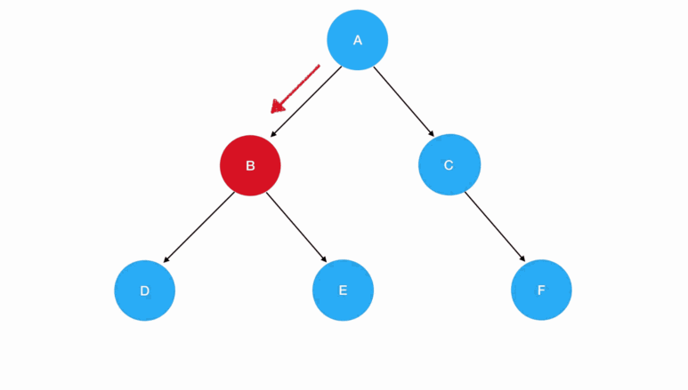
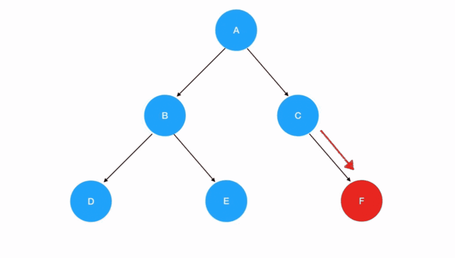
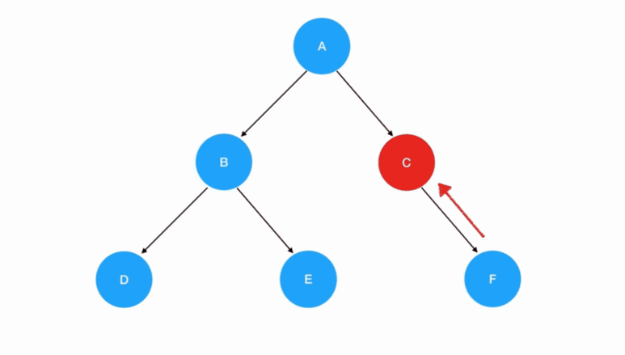

# 数据结构初体验

- 数组
- 栈
- 队列
- 链表
- 树

#### 数组
  
   1. 创建

      不知道它内部元素的情况 `new Array(长度)`
      
      创建一个长度确定、同时每一个元素的值也都确定的数组 `(new Array(7)).fill(1)`
   2. 访问/遍历
#### 二维数组

 1. 创建

     ```
     const len = arr.length
     for(let i=0;i<len;i++) {
         // 将数组的每一个坑位初始化为数组
         arr[i] = []
     }
     ```
 2. 访问

     ```
       // 缓存外部数组的长度
       const outerLen = arr.length
       for(let i=0;i<outerLen;i++) {
           // 缓存内部数组的长度
           const innerLen = arr[i].length
           for(let j=0;j<innerLen;j++) {
               // 输出数组的值，输出数组的索引
               console.log(arr[i][j],i,j)
           }
       }
     ```
#### 栈（Stack）—— 只用 pop 和 push 完成增删的“数组”
#### 队列（Queue）—— 只用 push 和 shift 完成增删的“数组”
#### 链表

  链表中，数据单位的名称叫做“结点”，而结点和结点的分布，在内存中可以是**离散**的。

  js表示：

  ```
    {
        // 数据域
        val: 1,
        // 指针域，指向下一个结点
        next: {
            val:2,
            next: ...
        }
    }      
  ```
  1. 创建
  ```
  function ListNode(val) {
    this.val = val;
    this.next = null;
  }

  const node = new ListNode(1)  
  node.next = new ListNode(2)
  ```
  2. 增加 - 变更前驱结点和目标结点的 next 指针指向

  ```
    // 如果目标结点本来不存在，那么记得手动创建
    const node3 = new ListNode(3)     
    // 把node3的 next 指针指向 node2（即 node1.next）
    node3.next = node1.next
    // 把node1的 next 指针指向 node3
    node1.next = node3    
  ```
  3. 删除 - 定位目标结点的**前驱结点**

  ```
  // 利用 node1 可以定位到 node3
  const target = node1.next  
  node1.next = target.next
  ```
#### 链表和数组的辨析
1. 数组 - 存储在连续的内存空间里

    JS 数组未必是真正的数组

    例如：`['haha', 1, {a:1}]`

2. 链表 - 高效的增删操作

    相对于数组来说，链表有一个明显的优点，就是**添加和删除元素都不需要挪动多余的元素**。仅仅是改变目标结点及其前驱/后继结点的**指针指向**。

3. 链表 - 麻烦的访问操作

    当我们试图读取某一个特定的链表结点时，必须**遍历整个链表来查找**它。
4. 结论：链表的插入/删除效率较高，而访问效率较低；数组的访问效率较高，而插入效率较低。

#### 二叉树

由根结点、左子树和右子树组成，且左右子树都是二叉树（左右子树的位置是严格约定、不能交换的）

js实现二叉树：
```
// 二叉树结点的构造函数
function TreeNode(val) {
    this.val = val;
    this.left = this.right = null;
}
```
js表示二叉树：
```
const root = {
  val: "A",
  left: {
    val: "B",
    left: {
      val: "D"
    },
    right: {
      val: "E"
    }
  },
  right: {
    val: "C",
    right: {
      val: "F"
    }
  }
};
```
二叉树的遍历：

- 递归遍历（先、中、后序遍历）
- 迭代遍历（层次遍历）

  递归函数的编写要点：
  - 递归式（每一次重复的内容）
  - 递归边界 （什么时候停下来）

1. 先序遍历


```
// 所有遍历函数的入参都是树的根结点对象
function preorder(root) {
    // 递归边界，root 为空
    if(!root) {
        return 
    }
     
    // 输出当前遍历的结点值
    console.log('当前遍历的结点值是：', root.val)  
    // 递归遍历左子树 
    preorder(root.left)  
    // 递归遍历右子树  
    preorder(root.right)
}
```

2. 中序遍历



```
// 所有遍历函数的入参都是树的根结点对象
function inorder(root) {
    // 递归边界，root 为空
    if(!root) {
        return 
    }
     
    // 递归遍历左子树 
    inorder(root.left)  
    // 输出当前遍历的结点值
    console.log('当前遍历的结点值是：', root.val)  
    // 递归遍历右子树  
    inorder(root.right)
}
```
3. 后序遍历



```
function postorder(root) {
    // 递归边界，root 为空
    if(!root) {
        return 
    }
     
    // 递归遍历左子树 
    postorder(root.left)  
    // 递归遍历右子树  
    postorder(root.right)
    // 输出当前遍历的结点值
    console.log('当前遍历的结点值是：', root.val)  
}
```