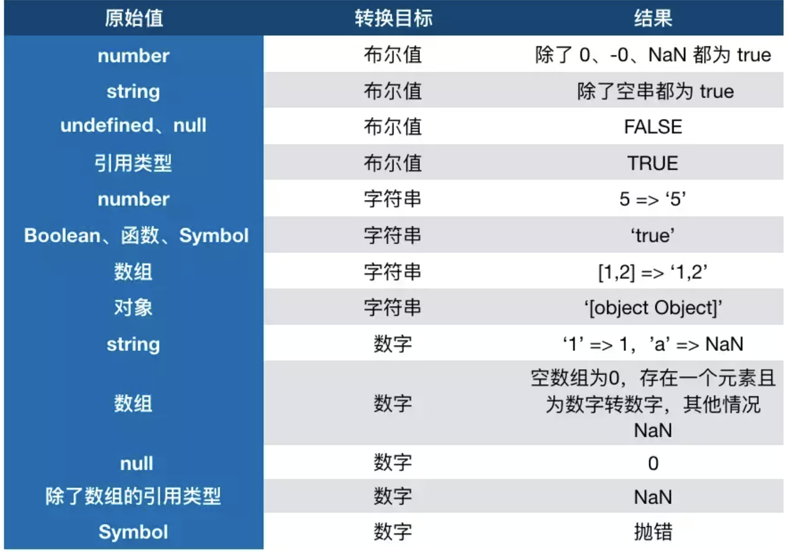

# js基础
#### 事件流
事件捕获(从document往事件目标触发) --> 事件冒泡(相反)

事件冒泡的应用--事件委托
#### 传参
传参，是按值传递（拷贝副本），基本数据类型会拷贝一份，引用数据类型拷贝引用地址
#### 赋值
原始类型的数据直接完整地复制变量值，对象数据类型的数据则是复制引用地址。
#### arguments
类数组对象：拥有一个 length 属性和若干索引属性的对象
类数组转数组
```
var arrayLike = {0: 'name', 1: 'age', 2: 'sex', length: 3 }
// 1. slice 返回值
Array.prototype.slice.call(arrayLike); // ["name", "age", "sex"] 
// 2. splice
Array.prototype.splice.call(arrayLike, 0); // ["name", "age", "sex"] 
// 3. ES6 Array.from 返回值
Array.from(arrayLike); // ["name", "age", "sex"] 
// 4. apply 返回值
Array.prototype.concat.apply([], arrayLike)
```
使用ES6的 ... 运算符，轻松转成数组
```
function func(...arguments) {

    //进入执行上下文时，重写初始化创建的arguments
    
    console.log(arguments); // [1, 2, 3]
}

func(1, 2, 3);
```
## 数据类型

#### 引用数据类型
  
   对象Object（包含普通对象-Object，数组对象-Array，正则对象-RegExp，日期对象-Date，数学函数-Math，函数对象-Function）

#### null不是对象
>虽然 typeof null 会输出 object，但是这只是 JS 存在的一个悠久 Bug。在 JS 的最初版本中使用的是 32 位系统，为了性能考虑使用低位存储变量的类型信息，000 开头代表是对象然而 null 表示为全零，所以将它错误的判断为 object 。

#### 基本包装类型（Boolean、Number、String ）

- '1'.toString()为什么可以调用？
```
var s = new Object('1');
s.toString();
s = null;
```

#### 精度缺失
- 0.1+0.2为什么不等于0.3？

    >0.1和0.2在转换成二进制后会无限循环，由于标准位数的限制后面多余的位数会被截掉，就已经出现了精度的损失

- BigInt(兼容性并不怎么好)
  
    BigInt是一种新的数据类型，用于当整数值大于Number数据类型支持的范围时。任何超出范围的整数值都可能失去精度。

    创建BigInt

    - 数字末尾追加n
    - BigInt()构造函数

#### JS中类型转换

==涉及一些类型转换

#### forEach中断问题
在forEach中用return不会返回，函数会继续执行。

中断方法：

- 使用try监视代码块，在需要中断的地方抛出异常。

- 官方推荐方法（替换方法）：用every和some替代forEach函数。every在碰到return false的时候，中止循环。some在碰到return true的时候，中止循环

#### ajax
###### 起因
Web的运作原理：一次HTTP请求对应一个页面。
###### 作用
如果要让用户留在当前页面中，同时发出新的HTTP请求，就必须用JavaScript发送这个新请求，接收到数据后，再用JavaScript更新页面，这样一来，用户就感觉自己仍然停留在当前页面，但是数据却可以不断地更新。
###### 具体实现
[链接](https://www.lagou.com/lgeduarticle/20341.html)