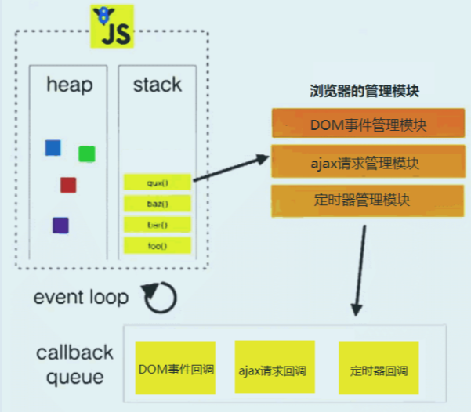

# promise
## 作用
- 解决回调地狱，函数嵌套，理解排查困难问题

## 简介

- promise有三种状态，pedding/resolved/rejected。
- promise new调用的时候会传入回调函数，这个回调函数中会注入两个方法，当异步结束的时候可以调用第一个函数，将状态改为resolved，将值传给成功的回调函数。
- 用then方法绑定回调函数

## 基本用法
 - Promise.all

    接收一组异步任务，然后并行执行异步任务，并且在**所有异步操作执行完**后才执行回调。
 - Promise.race

    接收一组异步任务，然后并行执行异步任务，**只保留取第一个**执行完成的异步操作的结果，其他的方法仍在执行，不过执行结果会被抛弃

 - Promise.prototype.finally：无论失败成功都会执行
 - 链式调用，实例上的方法和以上方法会返回一个promise实例
 - 取消promise，根据链式调用，`return new Promise(()=>{})`,返回`pedding`状态的promise

## async/await
- async函数返回promise
- await结合promise使用，阻塞代码，直到得到 resolve 的值
- 可用于，后面请求需要前面的一个甚至多个的结果的情况，同步写法，更优雅
- 可以.catch也可以try/catch捕获错误
## 业务场景
1. axios
   - axios是基于promise开发的
   - 使用时，进行二次封装，包一层Promise，并将Promise返回,免去传入请求方式，header传cookie等繁琐操作。
   - 响应拦截器，进行错误拦截，可以配置全局错误码，和业务模块错误码
2. vuex

    actions中向后台请求数据，为了确保dispatch后拿到数据再进行操作，在请求外面包一层Promise返回
## 任务队列
> 一个宏任务 —> 一队微任务 —> 渲染

**promise**

 - then在promise有结果后才进入微任务

 - 可以理解为await后面的内容就相当于放到了Promise.then里面,
 
   如果不是Promise对象的话，就会直接返回对应的值，相当于Promise.resolve()

**定时器**

新的宏任务，执行完一个宏任务，再执行第二个，宏任务执行完毕再执行此次宏任务中的微任务

>- 常见微任务：**promise.then**、**process.nextTick**（node）、**MutationObserver**
     
    优先级process.nextTick 高于 Promise
>- 常见宏任务：**setImmediate**（node）、**定时器**

## 事件循环队列
>宏任务微任务都属于事件队列

