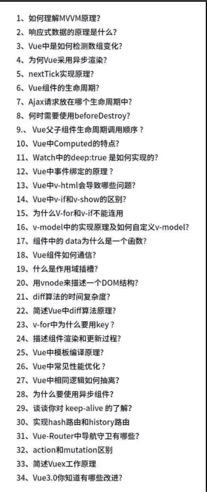

# vue
## 原理
> 正确高效的使用框架，必要时刻将会解决疑难杂症👍
#### 响应式原理
Observer

观察者，使用 Object.defineProperty 方法对对象的每一个子属性进行**数据劫持**/监听，在 get 方法中进行依赖收集，添加订阅者 watcher 到订阅中心。 在 set 方法中，对新的值进行收集，同时订阅中心通知订阅者们。

watcher

订阅者，首次解析的时候创建，当被观察的值发生变化时，会接收到来自订阅中心 dep 的通知，从而触发依赖更新。

核心方法有： get() 获得getter的值并且重新进行依赖收集 addDep添加一个依赖关系到订阅中心 Dep 集合中 ，update() 更新视图

Dep

调度中心，收集观察者 Watcher 和通知观察者目标更新。 每一个属性都有一个 Dep 对象,用于存放所有订阅了该属性的观察者对象，当数据发生改变时，会遍历观察者列表（dep.subs），通知所有的 watcher，让订阅者执行自己的 update 逻辑。

###### 响应式数据注意事项⚠️
vue无法检测到对象属性的添加或删除。但可以通过set方法使数据变成响应式并且触发更新页面。
```
单个属性：vm.$set(this.someObject,'b',2)
多个属性：vm.someObject = Object.assign({}, vm.someObject, { a: 1, b: 2 })
```

vue对数组放弃采用object.defineProperty，出于对性能和收益的权衡，采用监听7种变异方法,push/pop/shift/unshift/sort/splice/reverse，使新数据变响应并且手动触发页面更新，Vue.set()对于数组的处理其实就是调用了splice方法

#### 为什么vue3.0使用proxy实现响应式？
- Object.defineProperty只能劫持对象的属性，需要遍历对象的每个属性,而 Proxy 是直接代理对象。
- Object.defineProperty对新增属性需要手动进行 Observe。
- Es6 proxy 兼容性差，但存在新标准红利。
  
#### 虚拟DOM
>虚拟DOM总结：
>- 用JavaScript对象模拟DOM
>- 把此虚拟DOM转成真实DOM并插入页面中
>- 如果有事件发生修改了虚拟DOM
>- diff新老两棵虚拟DOM树的差异
>- 每点差异都要及时patch到真实dom上  

>虚拟DOM有效的降低大面积（真实DOM节点）的重排和排版，因为最终与真实DOM比较差异，可以只渲染局部。

>Vue 之所以引入了 Virtual DOM，更重要的原因是为了解耦 HTML 依赖，这带来两个非常重要的好处是：
>- 不再依赖 HTML 解析器进行模版解析，可以进行更多的 AOT 工作提高运行时效率：通过模版 AOT 编译，Vue 的运行时体积可以进一步压缩，运行时效率可以进一步提升；
>- 可以渲染到 DOM 以外的平台，实现 SSR、同构渲染这些高级特性，Weex 等框架应用的就是这一特性。

1. VNode模拟dom树 
2. diff算法（就地修改） 
   - 同层级比较，并不需要递归
   - Diff 的比较逻辑：能不移动，尽量不移动。不行就移动，实在不行就新建
     1. 能不移动，尽量不移动
    旧头 == 新头 旧尾 == 新尾
     2. 没得办法，只好移动
     旧头 == 新尾 旧尾 == 新头（首尾查找）
     看看有没有一样的key，有的话看看有没有变化，（单个查找）
     3. 实在不行，新建或删除
> 在比较过程中，不会对两个数组进行改变（比如不会插入，不会删除其子项）
而所有比较过程中都是直接 插入删除 真实页面DOM  
3. patch  


## 组件通信
- 父组件自定义事件传给子组件，子组件emit触发自定义事件，以参数形式将值传给父组件
- v-model其实是props,emit的语法糖
  v-model原理
`<input :value="msg” @input="msg=$event.target.value" />`
- .sync语法糖
- vuex

## 生命周期

## vue性能优化
大数据长列表，可采用虚拟滚动，只渲染少部分区域的内容
Vue 组件销毁时，会自动解绑它的全部指令及事件监听器，但是仅限于组件本身的事件。
beforeDestroy() { clearInterval(this.timer) }清除定时器

## 由面试题引发的思考

$extend

$nextTick 

nextTick可以使我们在下次DOM更新循环结束之后执行延迟回调，用于获得更新后的DOM

Keep-alive 组件缓存


Mvvm 软件架构设计模式，包含多种设计模式
Model代表数据模型负责业务逻辑和数据封装，View代表UI组件负责界面和显示，ViewModel监听模型数据的改变和控制视图行为，处理用户交互，简单来说就是通过双向数据绑定把View层和Model层连接起来。在MVVM架构下，View和Model没有直接联系，而是通过ViewModel进行交互，我们只关注业务逻辑，不需要手动操作DOM，不需要关注View和Model的同步工作。
v-show在初始渲染时有更高的开销，但是切换开销很小，更适合频繁切换的场景，v-if反之
Vue-router动态路由 传值通过/:id route.param ?xx=xx route.query
事件修饰符 stop阻止冒泡事件 prevent阻止默认事件 once一次渲染 静态信息避免重复渲染
自定义事件 sync native
用vue.extend做全局提示组件
单页面应用SPA的核心之一是：更新视图而不重新请求页面
