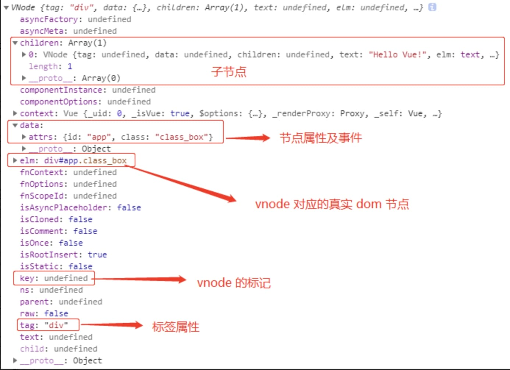
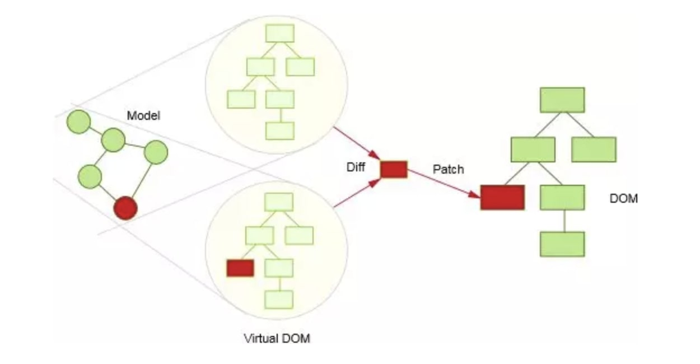
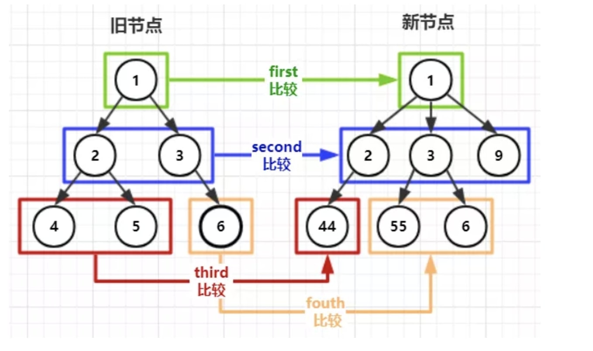
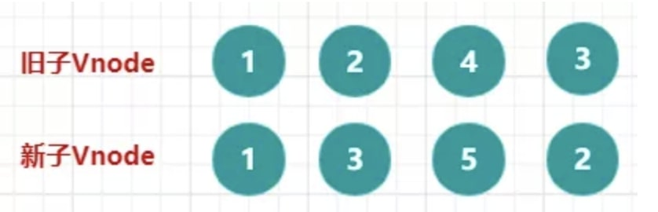
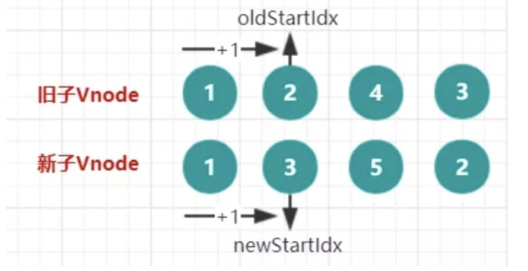
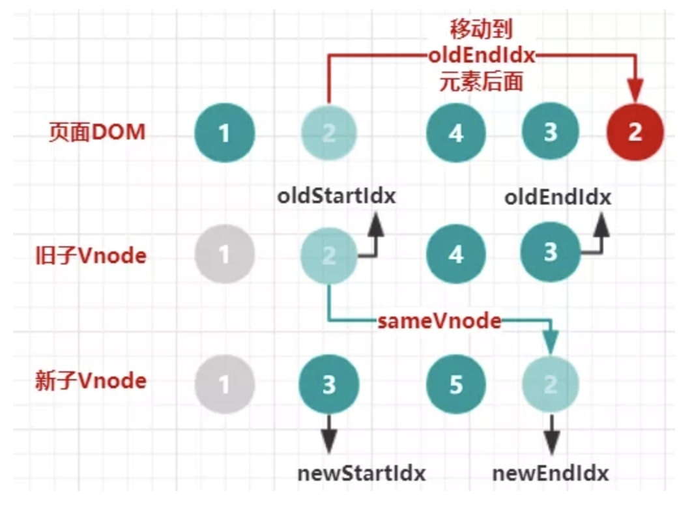
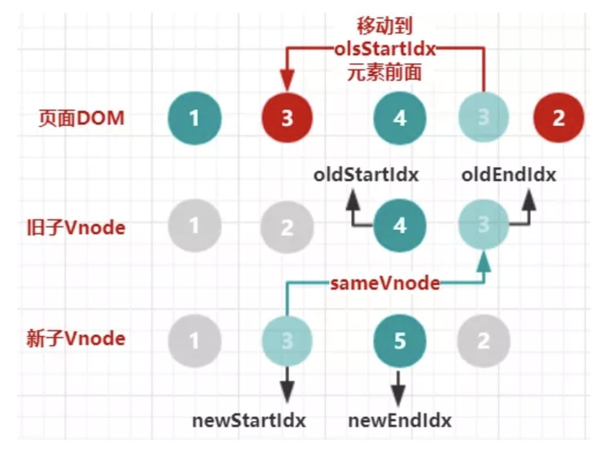
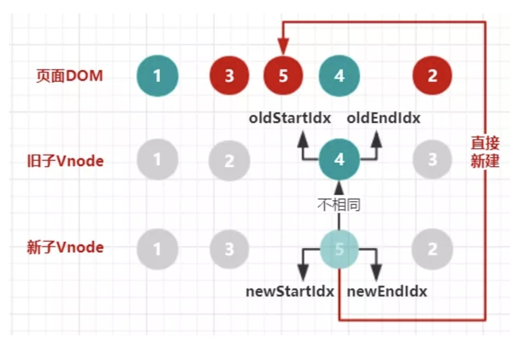
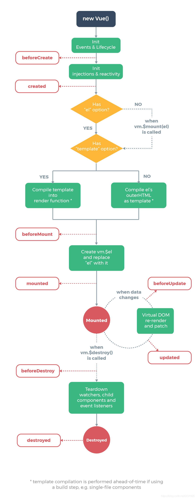

# vue
## 原理
> 正确高效的使用框架，必要时刻将会解决疑难杂症👍
#### 响应式原理
- Observer/观察者

  1. 使用 Object.defineProperty 方法对对象的每一个子属性进行**数据劫持**/监听
  2. 在 get 方法中进行依赖收集，添加订阅者 watcher 到订阅中心。 
  3. 在 set 方法中，对新的值进行收集，通知订阅中心，订阅中心通知订阅者们,从而触发更新。

- watcher/订阅者

  首次解析的时候创建，当被观察的值发生变化时，会接收到来自订阅中心 dep 的通知，从而触发更新。

  核心方法有： 
  
  get() 获得getter的值并且重新进行依赖收集 
  
  update() 更新视图

- Dep/订阅中心

  收集观察者 Watcher 和通知观察者目标更新。

  每一个属性都有一个 Dep 对象,用于存放所有订阅了该属性的观察者对象，当数据发生改变时，会遍历观察者列表（dep.subs），通知所有的 watcher，让订阅者执行自己的 update 逻辑。

#### 响应式数据增删问题
- 对象

  vue无法检测到对象属性的添加或删除。但可以通过set方法使数据变成响应式并且触发更新页面。
  ```
  单个属性：vm.$set(this.someObject,'b',2)
  多个属性：vm.someObject = Object.assign({}, vm.someObject, { a: 1, b: 2 })
  ```
- 数组

  出于对性能和收益的权衡，vue对数组放弃采用object.defineProperty。

  采用监听7种变异方法：push/pop/shift/unshift/sort/splice/reverse
  
  用这些方法使新数据变响应并且手动触发页面更新，Vue.set()对于数组的处理其实就是调用了splice方法

#### 为什么vue3.0使用proxy实现响应式？
- Object.defineProperty只能劫持对象的属性，需要遍历对象的每个属性,而 Proxy 是直接代理对象。
- Object.defineProperty对新增属性需要手动进行 Observe。
- Es6 proxy 兼容性差，但存在新标准红利。
  
#### 虚拟DOM
虚拟DOM概述：

  1. 用js对象模拟DOM,产生虚拟dom
  2. 把此虚拟DOM转成真实DOM并插入页面中
  3. 数据变化，生成新的虚拟dom
      - 通过diff算法，比较出新老两棵虚拟DOM树的差异
      - 差异patch到真实dom上  

虚拟DOM带来的好处：

- 虚拟DOM有效的降低大面积的重绘重排，最终与真实DOM比较差异，可以只渲染局部，提高了性能
- 解耦 HTML 解析器依赖，可以在更多平台执行，实现 SSR

1. VNode模拟dom树 
2. diff算法（就地修改） 
   - 同层级比较，并不需要递归
   - Diff 的比较逻辑：能不移动，尽量不移动。不行就移动，实在不行再增删

          旧头 == 新头 旧尾 == 新尾

          旧头 == 新尾 旧尾 == 新头（首尾查找）

          看看有没有一样的key，有的话看看有没有变化，（单个查找）

> 在比较过程中，不会对两个数组进行改变（比如不会插入，不会删除其子项），而所有比较过程中都是直接 插入删除 真实页面DOM  
3. patch  







## 组件通信
1. props & emit
   - props

     父传子
   - emit

     子传父
     
     子组件触发父组件的方法，以传参形式将数据传给父组件 
   - v-model可以实现父子组件双向数据绑定，本质是props,emit的语法糖

     v-model原理

      `<input :value="msg” @input="msg=$event.target.value" />`
   - .sync语法糖

2. 操作dom
   - $refs
     
     使用子组件的属性;调用子组件的方法，传参
   - $children $parent
3. provide & inject 
  
    主要为高阶插件/组件库提供用例

4. 插槽
  
    父向子传递标签

5. 自定义eventEmitter
6. vuex

## 生命周期


#### 创建阶段
1. beforeCreate
   
    new Vue({}) 创建vue实例
    
    初始化默认事件和生命周期
    
    执行beforeCreate钩子函数
  
    >这个时候，数据data、methods还没有挂载到vm对象，无法访问到数据data和真实的dom挂载元素el

2. created:
   
    初始化data和methods

    执行created钩子函数

    >这个时候,已可使用到数据data，也可更改数据data，在这里更改数据不会触发updated钩子函数，一般可以在这里做初始数据的获取。注意：此时挂件元素el还不存在

3. beforeMount
   
    判断对象是否有挂载元素el选项
    
    如果有的话就继续向下编译，如果没有el选项，则停止编译，也就意味着停止了生命周期，直到在该vue实例上手动挂载，即调用vm.$mount(el)。

    编译模版`<template>` -> 执行指令形成模版字符串 -> 虚拟DOM -> render
  
    执行beforeMount钩子函数
  
    >在这里也可以更改数据，不会触发updated

4. mounted
   
   render后，渲染出真实dom
   
   执行mounted钩子函数
  
    >组件已经出现在页面中，可以在这里操作真实dom
#### 运行阶段  
- beforeUpdate: data更改之后，会立即执行beforeUpdate
- updated: 
  
  生成新虚拟dom数，与旧dom树diff，patch到真实dom树

  dom也重新render完成
#### 销毁阶段
- beforeDestroy: 调用$destroy方法后，在实例销毁之前，立即执行beforeDestroy

  >实例仍然完全可用,一般在这里做一些善后工作，例如清除计时器

- destroyed: 组件的数据绑定、监听...去掉，执行 destroyed钩子函数

  >Vue 实例指示的所有东西都会解除绑定，所有的事件监听器会被移除，所有的子实例也会被销毁

#### 父子组件生命周期顺序
从外到内，然后再从内到外

destroyed和mounted一样都是先子再父


## vue性能优化
Vue 组件销毁时，会自动解绑它的全部指令及事件监听器，但是仅限于组件本身的事件。
beforeDestroy() { clearInterval(this.timer) }清除定时器

## 由面试题引发的思考
#### MVVM
  >Mvvm **软件架构设计模式**，包含多种设计模式。
  <br>
  <br>
  Model代表数据模型负责业务逻辑和数据封装，View代表UI组件负责界面和显示，ViewModel监听模型数据的改变和控制视图行为，处理用户交互，简单来说就是**通过双向数据绑定把View层和Model层连接起来**。
  <br>
  <br>
  在MVVM架构下，View和Model没有直接联系，而是**通过ViewModel进行交互**，我们**只关注业务逻辑**，不需要手动操作DOM，不需要关注View和Model的同步工作。

#### 组件中的data为什么是函数
  >组件是构造函数，注册组件是创建实例对象，data是函数，每个实例可以维护一份独立的拷贝,防止数据污染
#### keep-alive
  - keepalive是一个抽象的组件，缓存的组件不会触发mounted,为此提供activated和deactivated钩子函数
  - 3个属性,include/exclude/max,先匹配被包含组件的 name 字段，如果 name 不可用，则匹配当前组件 components 配置中的注册名称。
  - 与动态组件结合（tap）
    ```
    <!-- 失活的组件将会被缓存！-->
    <keep-alive>
      <component v-bind:is="currentTabComponent"></component>
    </keep-alive>
    ```
  - 与vue-router结合
    ```
    <keep-alive>
      <router-view v-if="$route.meta.keepAlive"></router-view>
    </keep-alive>
    <router-view v-if="!$route.meta.keepAlive"></router-view>

    ```
#### 异步组件
  - import
  
    `() => import('./my-async-component')` 

     这个 `import` 函数会返回一个 `Promise` 对象。
  - webpack代码分割
  
    `require(['./my-async-component'], resolve)`
  
#### vue为什么异步渲染  
  >Vue的变化侦测机制决定了它必然会在每次状态发生变化时都会发出渲染的信号，但Vue会在收到信号之后检查队列中是否已经存在这个任务，保证队列中不会有重复。如果队列中不存在则将渲染操作添加到**队列**中。
  <br>
  <br>
  之后通过异步的方式**延迟执行队列**中的所有渲染的操作并清空队列。
  <br>
  <br>
  这样当同一轮事件循环中反复修改状态时，并不会反复向队列中添加相同的渲染操作，可以提高性能
  <br>
  <br>
  所以我们在使用Vue时，修改状态后更新DOM都是异步的。

#### nextTick
  1. 原因：Vue DOM更新是异步执行的，即修改数据时，视图不会立即更新。为了确保拿到更新后的DOM，设置了nextTick。
  2. 原理：nextTick接受一个回调函数时，传入的回调函数会在callbacks中存起来，在flushCallbacks函数中遍历执行callback，flushCallbacks放到微任务或宏任务中延迟执行。根据当前环境判断使用哪种方式实现，优先级 Promise.then > MutationObserver(微任务) > setImmediate（node中宏任务） > setTimeout(fn, 0)
#### 指令
  1. v-html : 样式事件会失效
  2. v-if / v-show : v-show是dom树上有内容，不显示；v-if是dom树上无内容。v-show在初始渲染时有更高的开销，但是切换开销很小，更适合频繁切换的场景，v-if反之
  3. v-if & v-for : 不要同时使用在一个标签上，v-for 的优先级比 v-if 更高，这意味着 v-if 将分别重复运行于每个 v-for 循环中
#### 修饰符
  事件修饰符 
  - stop阻止冒泡事件 
  - prevent阻止默认事件 
  - once一次渲染 静态信息避免重复渲染


