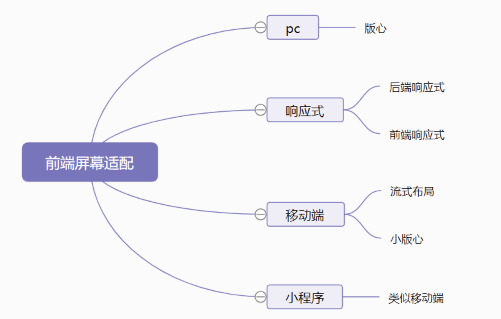

# 屏幕适配


## pc
版心布局
- 当屏幕大于版心宽度时，版心居中显示
- 当屏幕小于版心宽度时，屏幕出现一个横向的滚动条，这种方案几乎所有的PC端网站都在采用。

## 响应式
- 后端响应式
  
  >后台服务器根据前端浏览器的User-Agent来判断来源请求是PC端还是移动端，然后服务器动态返回PC端页面或者移动端页面。nginx中很容易就出现该功能。京东，天猫，淘宝也是这样子的。
- 前端响应式
  
  - 媒体查询 

  - 小版心（流式布局加最大宽度）
## 移动端
移动端设置视口
```
//理想视口 = 布局视口 = 视觉视口
<meta name="viewport" content="width=device-width; initial-scale=1; maximum-scale=1; minimum-scale=1; user-scalable=no;">
```
>device-width就等于理想视口的宽度，所以设置width=device-width就相当于让布局视口等于理想视口。
由于initial-scale = 理想视口宽度 / 视觉视口宽度，所以我们设置initial-scale=1;就相当于让视觉视口等于理想视口。


- **流式布局**
>也叫做百分比布局，指的是页面上大部分的容器和元素的宽度都不是定死，可能是 百分比单位，也可能是rem单位

1. 普通的图片和容器，写单位的时候换成 百分比 或者 flex即可。

2. 对于页面中的某些元素，如字体大小，可以使用 **淘宝 flexibile + rem** 的解决方案,淘宝flexible是手淘团队出的一个处理移动端rem设置的js库

   - 把**根标签的字体大小（rem）** 改成了 当前 **屏幕（clientWidth）的十分之一**大小
   - 根标签的字体大小发生改变了，使用了rem单位的元素或者字体大小也跟着改变

- **小版心**
  
小板心的做法其实也是流式布局中的一种，只不过对最外层容器加了一个最大宽度的设置
- **vw 和 vh**
  
  单位 | 名称 
  ----|------
  vw | 100vw 等于 视口的宽度  
  vh | 100vh 等于 视口的高度  
  vMax | vw 和 vh 中的较大的那个  
  vMin | vw 和 vh 中的较小的那个  


