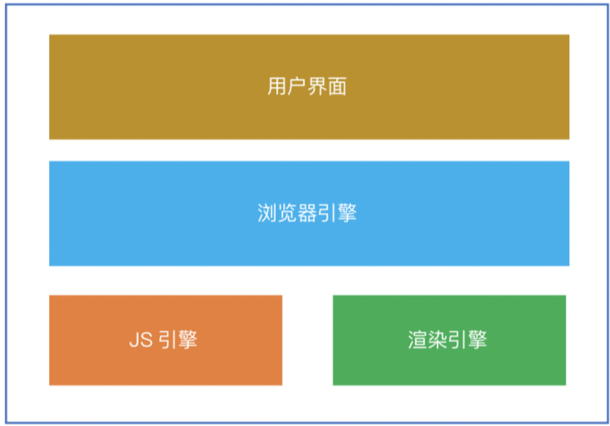
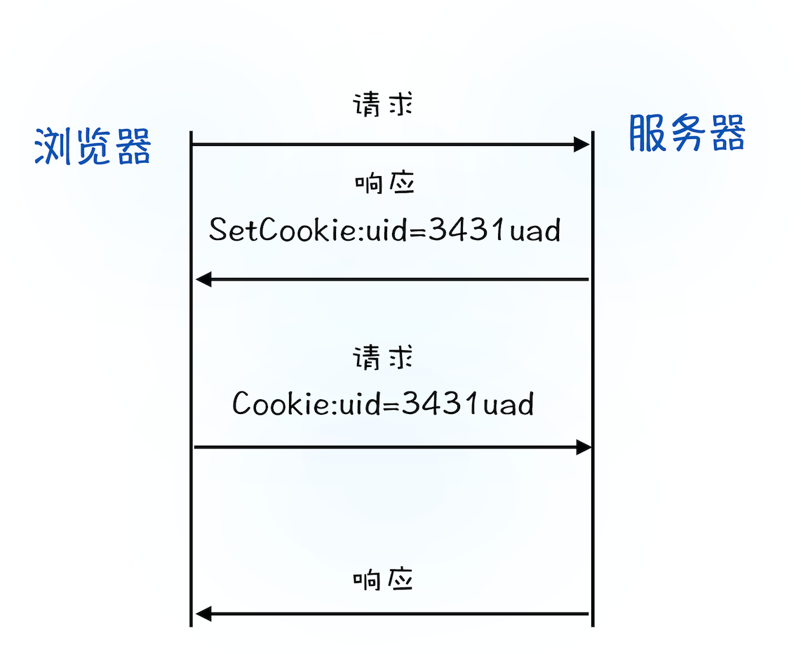

# 浏览器
- 用户界面

>除了浏览器主窗口显示请求的页面之外，其他显示的部分都属于用户界面。

- 浏览器引擎(负责窗口管理、Tab进程管理等)
- 渲染引擎(又叫内核，负责HTML解析、页面渲染)
- JS引擎(JS解释器，如Chrome和Nodejs采用的V8)

## 浏览器的多进程架构

1. 浏览器进程

    主要负责界面显示、用户交互、子进程管理，同时提供存储等功能，**整个浏览器应用程序只有一个**，对应上述浏览器组成中的浏览器引擎。

2. GPU进程

    负责GPU渲染，**整个浏览器应用程序只有一**个

3. 网络进程
    
    主要负责页面的网络资源加载，之前是作为一个模块运行在浏览器进程里面的，直至最近才独立出来，成为一个单独的进程。

4. 渲染进程

    将 HTML、CSS 和 JavaScript 转换为用户可以与之交互的网页，(chrome)排版引擎 Blink 和 JavaScript 引擎 V8 都是运行在该进程中。**每个Tab窗口页对应一个渲染进程**。出于安全考虑，渲染进程都是运行在**沙箱模式**下。

5. 插件进程

    浏览器安装的插件(扩展程序)，**每个插件会创建一个进程**

#### 一个渲染进程主要包括如下线程：

1. GUI线程(主要负责解析HTML、CSS和渲染页面)

2. JS引擎线程(负责解析和执行JS代码)

3. 事件线程(控制事件循环)

4. 定时器线程(处理定时器相关逻辑)

5. 异步请求线程(发起Ajax时会生成该线程)

    同步和异步
    >同步是代码执行后就可以获得想要的结果，异步是指代码执行之后不能立即获得结果，
    
    同步任务和异步任务
    >同步任务指的是，在主线程上排队执行的任务，只有前一个任务执行完毕，才能执行后一个任务；异步任务指的是，不进入主线程，而是由事件线程调度，在满足执行条件的时候放到事件队列中，等待主线程(JS线程)的执行。

线程规则：
- 一个渲染进程同时只有一个JS解析线程在运行

- JS引擎线程不停的处理事件线程推送到事件队列中的任务

- 定时器和异步请求最终生成的回调事件也由事件线程来控制和管理

>在ES6当中，引入了microtask的概念，microtask会在当前的任务执行完成之后立即执行。

#### 未来面向服务的架构
## TCP/IP

互联网，实际上是一套理念和协议组成的体系架构。其中，协议是一套众所周知的规则和标准，如果各方都同意使用，那么它们之间的通信将变得毫无障碍。

- IP：把数据包送达目的主机

- UDP：把数据包送达应用程序

- TCP：把数据完整地送达应用程序

  - 对于数据包丢失的情况，TCP 提供重传机制；
  - TCP 引入了数据包排序机制，用来保证把乱序的数据包组合成一个完整的文件。
## HTTP请求
HTTP协议和TCP协议都是TCP/IP协议簇的子集。

HTTP协议属于应用层，TCP协议属于传输层，HTTP协议位于TCP协议的上层。

1. 构建请求头(请求方法/请求URL/请求版本号)
   
   `GET /index.html HTTP1.1`
2. 查找缓存
3. 请求 DNS 返回域名对应的 IP，浏览器还提供了 DNS 数据缓存服务
4. Chrome 有个机制，同一个域名同时最多只能建立 6 个 TCP 连接，超出的会等待
      
## 浏览器缓存

[参考](https://www.cnblogs.com/lyzg/p/5125934.html)

>浏览器在加载资源时，先根据这个资源的一些http header判断它是否命中**强缓存**，强缓存如果命中，浏览器直接从自己的缓存中读取资源，不会发请求到服务器。
 
 
当强缓存没有命中的时候，浏览器一定会发送一个请求到服务器，通过服务器端依据资源的另外一些http header验证这个资源是否命中**协商缓存**，如果协商缓存命中，服务器会将这个请求返回，但是不会返回这个资源的数据，而是告诉客户端可以直接从缓存中加载这个资源，于是浏览器就又会从自己的缓存中去加载这个资源

#### 强制缓存
  >强制缓存通常是用在图片或者logo这样长久不会更改的资源上的
   
   
  当第一次访问资源的时候，会正常拿到**200**的状态码
   
   
  当第二次访问资源的时候，就会去浏览器的缓存里找缓存文件使用了，不过返回的状态码仍然是**200**

  强制缓存主要是通过响应头Cache-Control和Expires来设置的
  
  Cache-Control： 相对时间，http1.1里添加的字段，优先级更高
  
  Expires：绝对时间，很早就有了，为了兼容低版本
  
  具体过程：
  1. 浏览器第一次跟服务器请求一个资源，服务器在返回这个资源的同时，在respone的header加上Expires的header

  2. 浏览器在接收到这个资源后，会把这个资源连同所有response header一起缓存下来

  3. 浏览器再请求这个资源时，先从缓存中寻找，找到这个资源后，拿出它的Expires跟当前的请求时间比较，如果请求时间在Expires指定的时间之前，就能命中缓存，否则就不行。

  ⚠️强缓存的管理：后端配置不强制缓存/ctrl+f5
 #### 协商缓存
  >当第一次访问资源的时候，会正常拿到200的状态码，服务端会把**缓存标识**和数据一起返回
   
   
  当第二次访问资源的时候，就会把缓存标识发给服务端，服务端去校验是否匹配，匹配成功就返回304，直接使用缓存即可

  协商缓存常见的也是两种，【Last-Modified，If-Modified-Since】(时间) 和【ETag,If-None-Match】
  
  Last-Modified：服务端会通过客户端发来的
If-Modified-Since和本地的Last-Modified的值比对
  
  Etag：服务端会通过客户端发来的If-None-Match和Etag的值比较
  
  具体过程：
  1. 浏览器第一次跟服务器请求一个资源，服务器在返回这个资源的同时，在respone的header加上Last-Modified的header，这个header表示这个资源在服务器上的最后修改时间

  2. 浏览器再次跟服务器请求这个资源时，在request的header上加上If-Modified-Since的header，这个header的值就是上一次请求时返回的Last-Modified的值

  3. 服务器再次收到资源请求时，根据浏览器传过来If-Modified-Since和资源在服务器上的最后修改时间判断资源是否有变化，如果没有变化则返回304 Not Modified，但是不会返回资源内容；如果有变化，就正常返回资源内容。response header中不会再添加Last-Modified（由于ETag重新生成过，response header中还会把这个ETag返回，即使这个ETag跟之前的没有变化）
  4. 浏览器收到304的响应后，就会从缓存中加载资源。

  5. 如果协商缓存没有命中，浏览器直接从服务器加载资源

⚠️如果不启用强缓存的话，协商缓存根本没有意义。浏览器的默认行为会把静态资源缓存一段时间，尽管没有在服务器给这些资源配置强缓存
#### 强制不缓存
  
  设置Cache-Control: no-store
  
  no-cache这个值，实际上它依然会缓存但是每次都像服务器发请求罢了
#### 浏览器行为对缓存的影响

- ctrl+f5强制刷新网页,直接从服务器加载，跳过强缓存和协商缓存

- f5刷新网页时，跳过强缓存，但是会检查协商缓存
## cookie

## 输入URL到页面展示

1. 用户输入
   - 如果是搜索内容，地址栏会使用浏览器默认的搜索引擎，来合成新的带搜索关键字的 URL。
   - 如果判断输入内容符合 URL 规则，根据规则，自动补全协议

    浏览器还给了当前页面一次执行 beforeunload 事件的机会
2. URL请求

    浏览器进程会通过进程间通信（IPC）把 URL 请求发送至网络进程
    - 重定向

        在导航过程中，如果服务器响应行的状态码包含了 301、302 一类的跳转信息，浏览器会跳转到新的地址继续导航
        （用户发出 URL 请求到页面开始解析的这个过程，就叫做导航）
    - 响应数据类型处理

        Content-Type 是 HTTP 头中一个非常重要的字段， 它告诉浏览器服务器返回的响应体数据是什么类型
3. 准备渲染进程

    如果从一个页面打开了另一个新页面，而新页面和当前页面属于同一站点的话，那么新页面会复用父页面的渲染进程
4. 提交文档

   - 首先当**浏览器进程**接收到网络进程的响应头数据之后，便向**渲染进程**发起“**提交文档**”的消息；
   - **渲染进程**接收到“提交文档”的消息后，会和**网络进程**建立传输数据的“管道”；
   - 等文档数据**传输完成**之后，渲染进程会返回“**确认提交**”的消息给浏览器进程；
   - 浏览器进程在收到“确认提交”的消息后，会**更新浏览器界面状**态，包括了安全状态、地址栏的 URL、前进后退的历史状态，并更新 Web 页面。

    
5. 渲染阶段

    页面生成完成，渲染进程会发送一个消息给浏览器进程，浏览器接收到消息后，会停止标签图标上的加载动画。
## 渲染

1. 构建dom树
2. 构建css树
   1. 把 CSS 转换为浏览器能够理解的结构
   2. 需要将所有值转换为渲染引擎容易理解的、标准化的计算值
   3. 计算出 DOM 树中每个节点的具体样式，按照CSS 的继承规则和层叠规则，CSS 继承就是每个 DOM 节点都包含有父节点的样式
3. 布局树及布局计算
4. 分层树
   - 拥有层叠上下文属性（定位属性、透明属性、css滤镜filter）的元素会被提升为单独的一层
   - 需要剪裁（clip）的地方也会被创建为图层（overflow）
   - 如果一个节点没有对应的层，那么这个节点就从属于父节点的图层
5. 绘制 -> 绘制列表包含绘制指令
6. 图快 -> 位图 -> 合并显示
   
   1. 合成线程将图层分成图块，并在光栅化线程池中将图块转换成位图。
   2. 合成线程发送绘制图块命令 DrawQuad 给浏览器进程。
   3. 浏览器进程根据 DrawQuad 消息生成页面，并显示到显示器上。

