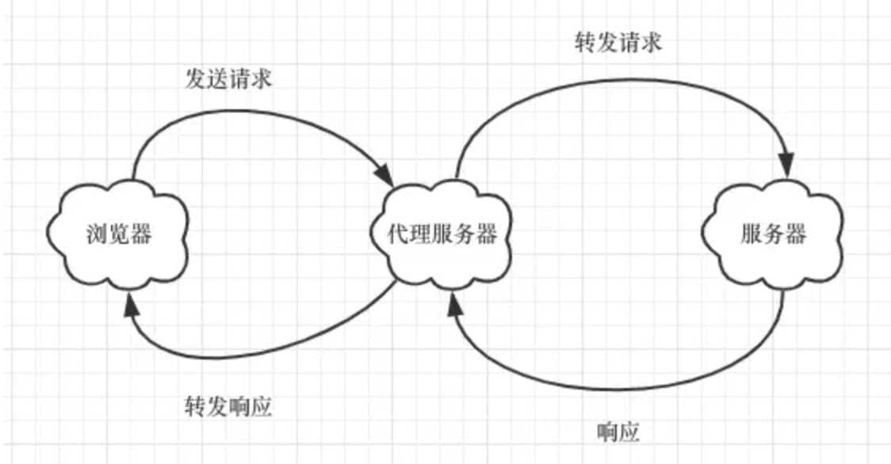

# 跨域
浏览器同源策略，协议、域名、端口号要求一样，否则会引发跨域问题

>没有同源策略引发CSRF攻击
假设你是a.com网站的管理员，你在a.com网站有一个权限是删除用户，比如说这个过程只需用你的身份登陆并且POST数据到http://a.com/deleteUser，就可以实现删除操作。
然后假设有个b.com网站被攻击了，别人种下了恶意代码，你点开的时候就会模拟跨域请求（你同时在浏览器中不同标签打开了a.com和b.com网站，并且你已经登录了a.com），那么b.com的恶意代码就可以模拟对a.com的跨域请求，模拟一个用户删除操作是很简单的（当然是攻击者有意针对，而且知道了删除接口）。
## JSONP
只支持 GET 请求，但是可以兼容老式浏览器
## CORS
支持所有的 HTTP 请求，是跨域最主流的方案
>**跨域的请求其实是发出去了的，只不过被浏览器给拦截了**，因为不安全，说直白点儿就是，你想要从服务器哪儿拿个东西，但是没有经过人家允许啊。所以怎么样才安全 ？服务器允许了不就安全了，这就是 CORS 实现的原理：**使用额外的 HTTP 头来告诉浏览器，让运行在某一个 origin 上的 Web 应用允许访问来自不同源服务器上的指定的资源。**

- 简单请求GET、POST（也与请求头的字段有关）
  前端自动带origin
  后端配置Access-Control-Allow-Origin 
- 非简单请求PUT、DELETE
  自动预请求OPTIONS
- 默认情况下， 任何跨域请求都不会带上cookies
  前端 : xhr.withCredentials = true;
  后端 : Access-Control-Allow-Credentials，而且Access-Control-Allow-Origin   != *,只能是固定的一个域名
## Nginx反向代理
利用了服务器对服务器没有同源策略限制

## webpack
利用了服务器对服务器没有同源策略限制
>本地会虚拟一个**node服务端**接收你的请求并代你发送该请求，这样就不会有跨域问题了，当然这只适用于**开发环境**。
## websocket
实现了浏览器与服务器的全双工通信
>在建立连接之后，server 与 client 都能主动向对方发送或接收数据。
Websocket 属于长连接，在一个页面建立多个 Websocket 连接可能会导致性能问题。

